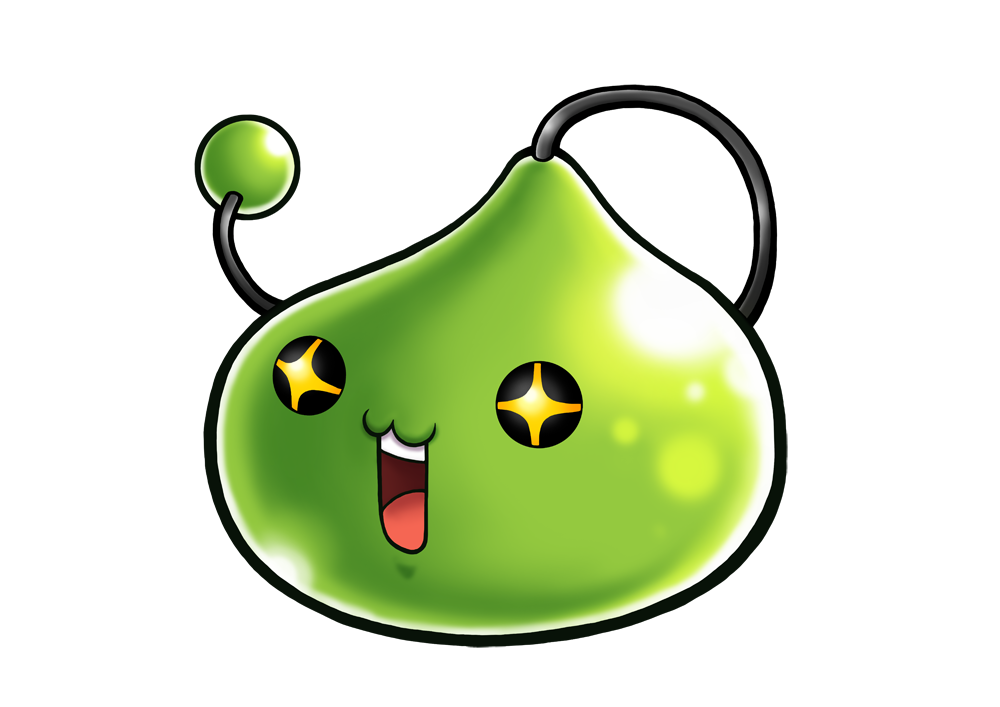

# Slime Bot

# A discord bot built for Maplestory M using discord.js. 

 - Utilizes **Enmap** for per-server configurations and **Cron** for scheduled messages.
  

## Functionalities:

- 15 minute reminders for afternoon and nighttime expeditions! Customize message and channel it sends to.

- Set 15 minute banquet reminders at your own time. Customize message and channel it sends to.

- Greets new guild members. Customize private welcome greeting.

- !fuse command to help with fusing - includes cost and data (treasure pulls, powder, equips)

- !jewel command for jewel data.

- !chaos command for organizing chaos expeditions.

## Commands: 

- !fuse - helps with fusing costs.

- !jewel - jewel data

- !chaos - organizing chaos expedition

- !help - shows bot's commands.

- !showconf - shows current configurations (GM only)

- !setconf - edit configurations (GM only)
  
- !resetconf - resets configurations to default settings (GM only)

# IMPORTANT - please give yourself the role of 'GM' in order to start using admin commands such as !setconf and !showconf.

## Configuration Help:

### What are configs and why they are important
 
- Every guild discord is different - they have their own specific channels, banquet times, GMs want their own reminder messages, etc etc. Configurations basically help you edit all of these to your liking.

### Configuration Keys and Value

- There are 2 parts to my configurations: **keys and values**.

- The **key** is the type of configuration. 

- Some examples of **keys** include: 'expoMessage', 'banquetTime', 'expoChannel', & 'privateMessage'.

- The **value** is the value of that particular **key**, and this is what you will be changing. 

- For example, the default **value** of the **key** 'expoChannel' is set to 'general'. This means that my expedition reminders will be sent to the channel called 'general' by default. 

- If you don't have a channel called 'general', or want me to send expedition reminders to a different channel, let's say a channel called 'expedition-reminders', you would change the **value** of expoChannel to 'expedition-reminders'."
                  
### Changing values
- To change the value of a key, type !setconf followed by the **key** and then the **value** you want.

- For the example above, simply type **!setconf expoChannel expedition-reminders**. This will set my expedition reminder messages to send only to the channel **expedition-reminders**.

- You can then type **!showconf** to view your changes. Simple enough, right?

- If you're not getting reminders from me, there is probably an error in your configs (check spelling and/or letter casing). 

- Now go edit your configs!
  

### Default Configurations

- **adminRole** : GM <-- ***important: make sure to assign 'GM' role to yourself so you can use !setconf.***

- **privateMessage** : Hi there, welcome to our discord! Please change your nickname to your in-game IGN. Type !help for my list of commands!

- **expoChannel** : general

- **expoMessage** : @everyone Expeditions are starting in 15 minutes! Good luck!

- **banquetTime** : 00 18 <-- ***important: banquetTime is formatted by [minute][hour] in server time, so 00 18 = 6pm server time. Keep this in mind when setting your own banquetTime!***

- **banquetChannel** : general

- **banquetMessage** : @everyone Banquet is starting in 15 minutes!

                 
### Keys and their functionalities

- **adminRole** : name of admin role. Only people with this role can use !setconf. Defaults to 'GM' and is not shown/cannot be changed.

- **privateMessage**: I will send this private DM to new guild members when they join the server.

- **expoChannel**: The channel I will send my expedition reminders to. 

- **expoMessage**: This message will be sent to the expoChannel **15 minutes** prior to expeditions. 

- **banquetTime**: the time you want me to remind your guild about banquet. 

- **banquetChannel**: the channel I will send the banquetMessage to. 

- **banquetMessage**: the message I will send to banquetChannel.

